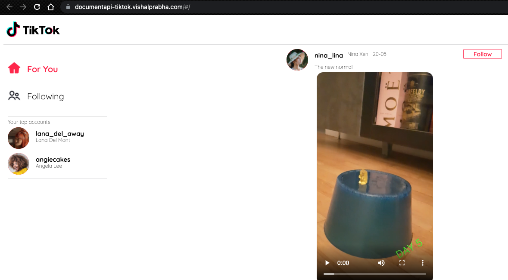

<!--- STARTEXCLUDE --->
# Astra DB TikTok Clone Workshop

&nbsp;

 

## 📝 Description
Developed a simple Tiktok clone running on **Astra DB** that leverages **Document API** as part of a workshop. 

 

## 🎯 Objectives

* Leverage DataStax's Astra DB and GitPod.
* Learn about *Document API*, *serverless functions* and how they scale.
* Understand concepts on CDN services, CI/CD pipeline, JAM stack and how they all work together.
* Deploy Tiktok clone to production with Netlify.
* Test the serverless functions in Netlify and Swagger UI. 

 

## 📋 Outcome

 

## ✍ Acknowledgements

* [DataStax](https://www.datastax.com/)
* [Netlify](https://app.netlify.com/)
* [AstraDB](https://www.datastax.com/products/datastax-astra)
* [Ania's Tiktok clone Video](https://youtu.be/IATOicvih5A)
